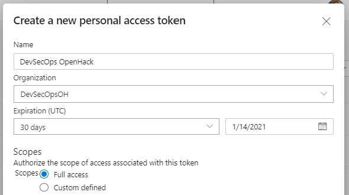
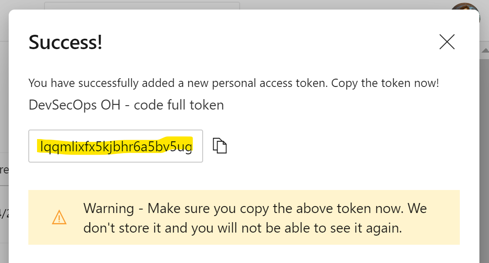

# DevSecOps OpenHack Light deployment script

This script deploys and configures all the resources your team will need in order to complete the challenges during the OpenHack. These resources:

* **Deployed to Opsgility Subscription**
  * Azure Key Vault
  * Azure Container Registry
  * App Service
  * App Service Plan
  * Virtual Machine running Aqua

* **Deployed to Microsoft Azure DevOps Organization (<https://dev.azure.com/DevSecOpsOH>)**
  * Azure DevOps Project

## How to deploy lab env

### Preprequisites

* Linux/WSL - provisioning scrips are using Bash
* jq - the jq command line processor (`sudo apt-get install jq`)
* Azure CLI - with JSON as the default output format (`az configure`)

### High Level Overview

1. Az Login to Opsgility subscription

2. Provision Azure Resources in Opsgility subscription

3. Az Login using your MSFT Account

4. Prepare Personal Access Token (PAT) for Azure DevOps

5. Deploy Azure DevOps project

6. Assign Attendees to Projects

7. Save your work

### 1. Az Login to Opsgility Subscription

Using the one of the credentials provided by Opsgility, execute an AZ Login (For testing you can either your internal subscription or MSDN subscription)

```bash
#For Opsgility use
az login -u <username> -p '<password>'

#For Internal or MSDN use (Will take you to browser to complete sign-in)
az login
```

### 2. Provision the Azure Resources in Opsgility subscription

This assumes you are in the root of repo. On Windows ensure that all scripts use the LF line endings after cloning (easy to change in VS Code).

```bash
./provision_azure_resources.sh -l centralus -t <teamNumber>
```

Once this script completes, two files will be present in the scripts directory. They are acr.json and subscription.json. These files contain information needed during the provisioning of DevOps resources in step 4. Do not delete them. Keeping a copy of these files after the provisioning has completed will save time during some of the challenges by making information quickly available to the team.

### 3. Prepare Personal Access Token (PAT) for Azure DevOps

Personal Access Token is required to configure Project, Git repo, Pipelines, assign access, etc. To get PAT, please follow below steps:

1. Go to [https://dev.azure.com/DevSecOpsOH/_usersSettings/tokens](https://dev.azure.com/DevSecOpsOH/_usersSettings/tokens), and click **New Token**.

1. Fill out Name for your token (e.g. DevSecOps OpenHack), and select **Full acces** under **Scopes** section.

    

1. Save your Token for later use in the next sectios (4. Deploy Azure DevOps project & 5. Assign Attendees to Project).

    

### 4. Deploy Azure DevOps project

Provision the DevOps project by running the script below. You will pass the same team number, and PAT created in previous section.

```bash
./provision_devops.sh -t <teamNumber> -s '<personalAccessToken>'
```

Example: Provision the project for team 1.

```bash
./provision_devops.sh -t 1 -s 'lqqmlixfx5sgfsfguu7bhsv5uggsdhjfkuhkhlljlkh2yyfgklsa'
```

### 5. Assign Attendees to Project

Finally, collect aliases of all Attendees. You will pass the same team number, and a **comma-separated list** of emails for users that should be assigned into the project.

```bash
./assign_attendees.sh -u <Comma separated usernames> -t <teamNumber> -s '<personalAccessToken>'
```

Example: Assign access to ADO project for Dariusz Porowski and Richard Guthrie who are in team 1.

```bash
./assign_attendees.sh -u daporo@microsoft.com,rguthrie@microsoft.com -t 1 -s 'lqqmlixfx5sgfsfguu7bhsv5uggsdhjfkuhkhlljlkh2yyfgklsa'
```

### 6. Save your work

Keep the `<teamName>_subscription.json` and `<teamName>_acr.json` files you will need them in Challenge 1.
